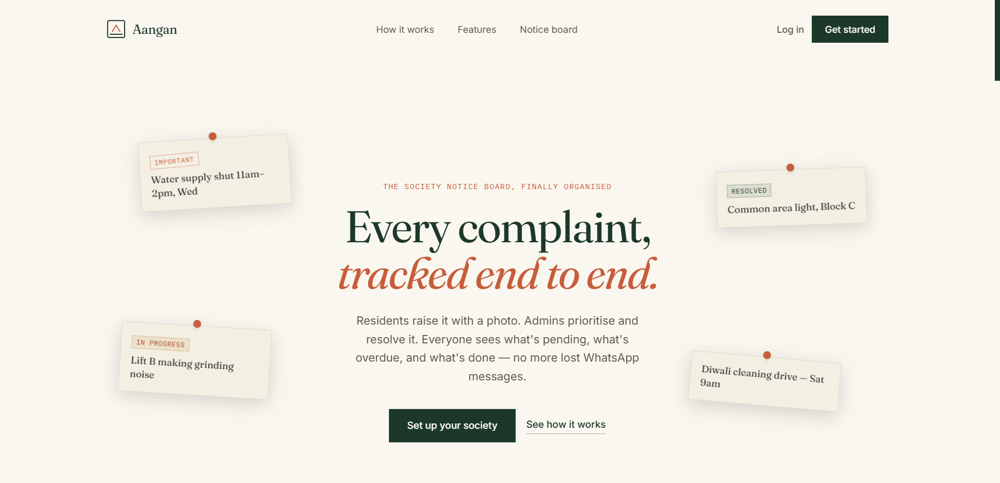

<div align="center">

# 🏘️ Aangan
### Society Maintenance Tracker

**A multi-tenant complaint and notice-board platform for apartment societies.**  
Each society is fully isolated — admins create a society, residents join with a code, and zero cross-society data leaks are possible by design.

[](https://nodejs.org/)
[](https://expressjs.com/)
[](https://www.prisma.io/)
[](https://postgresql.org/)
[](https://reactjs.org/)
[](https://vitejs.dev/)

</div>

---

## 🖼️ Preview

> *(Drop a screenshot of the corkboard hero here — drag a PNG into the file on GitHub)*



---

## 🧩 What Is Aangan?

**Aangan** (Hindi/Urdu for *courtyard*) is a complaint and notice-board platform built for the shared heart of an Indian housing society — where residents raise issues, track resolution, and stay informed through a community notice board.

The platform is **multi-tenant by design**: every society operates in complete isolation. Admins create a society and receive a unique join code. Residents can only register with a valid code, and **every single backend query is scoped to the logged-in user's society** — making cross-society data leaks structurally impossible, not just policy-enforced.

> 📘 See [`backend/README.md`](backend/README.md) for the full tenant-isolation implementation details.

---

## ✨ Features

### 🔐 Multi-Tenant Auth & Society Management
- Society creation with a unique, shareable join code
- Resident registration gated behind a valid join code
- Backend-enforced query scoping — no cross-tenant data access possible

### 📋 Complaints
- Raise a complaint with photo upload
- Full complaint history timeline per resident
- Admin complaint management dashboard
- Automatic **overdue detection** based on configurable threshold

### 📢 Notice Board
- Society-wide announcements visible to all residents
- Chronological, admin-managed posts

### ⚙️ Admin Tools
- Society settings — join code regeneration, overdue threshold config
- Centralized dashboard for complaint and notice oversight

### 📱 Responsive Design
- Mobile drawer navigation, fully wrapping layouts
- Built to be PWA-ready or shared with a future React Native app

---

## 🛠️ Tech Stack

| Layer | Technology |
|---|---|
| **Backend** | Node.js · Express · Prisma ORM · PostgreSQL |
| **Frontend** | React · Vite |
| **Email** | Nodemailer (Gmail App Password) |
| **Photo Upload** | Cloudinary (wiring in place) |
| **Future** | React Native (`mobile/`, shares the same backend API) |

---

## 📂 Project Structure

```
society-maintenance-tracker/
├── backend/      # Express + Prisma + PostgreSQL REST API
├── frontend/     # React + Vite web app (this is what users see)
└── mobile/       # (future) React Native app, same backend API
```

---

## 🎨 Design Direction

| Element | Choice |
|---|---|
| **Name** | *Aangan* — Hindi/Urdu for "courtyard," the shared heart of an Indian housing society |
| **Palette** | Warm plaster paper · deep verandah green · rust/terracotta accent · brass marigold |
| **Typography** | Fraunces (headlines) · Inter (body) · IBM Plex Mono (status tags, timestamps) |
| **Signature Element** | The marketing hero is a literal corkboard — pinned, rotated cards |

---

## 📊 Project Status

| Area | Status |
|---|---|
| Landing page (design system, marketing site) | ✅ Done |
| Backend API — auth, society join/create, complaints, notices, dashboard, multi-tenant isolation, overdue detection, email + photo wiring | ✅ Done |
| Frontend — auth, dashboards, raise complaint w/ photo, complaint timeline, notice board, admin tools, society settings | ✅ Done |
| Fully responsive (mobile drawer nav, wrapping layouts) | ✅ Done |
| Deployment (Render/Vercel) | ⏳ Not yet |
| Mobile app (React Native) | ⏳ Not yet |
| Production email/photo credentials | ⏳ Not yet |
| System design write-up | ⏳ Not yet |

---

## 🚀 Run It Locally

### 1. Backend

```bash
cd backend
npm install
cp .env.example .env       # fill in your real DATABASE_URL etc.
npx prisma generate
npx prisma migrate dev --name init
npm run dev                 # → http://localhost:5000
```

### 2. Frontend

```bash
cd frontend
npm install
npm run dev                 # → http://localhost:5173
```

> The frontend's `.env` already points `VITE_API_URL` at `http://localhost:5000/api`.

---

## 🔮 Next Steps

1. Deploy backend (Render/Railway) and frontend (Vercel)
2. Add Cloudinary + Gmail App Password credentials for live photo/email
3. Write the system design document (required deliverable, 800 words max)
4. Scaffold `mobile/` with React Native, pointed at the same backend

---

## 📄 License

MIT — open source and free to use.

---

<div align="center">
  Built for every courtyard 🏘️<br/>
  by <a href="https://github.com/Aditya-dxt">Aditya Dixit</a>
</div>
